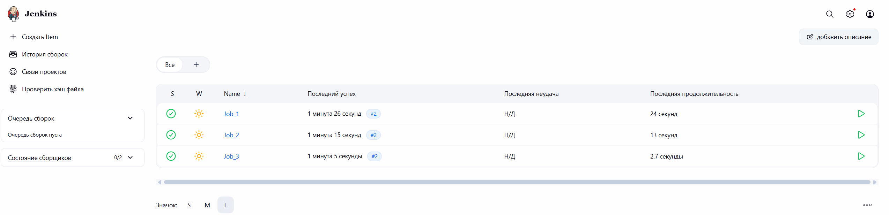

# Подтверждение выполнения задания 8

Дата проверки: 3 сентября 2026 года.

## Автоматический запуск

В начале Console Output сборки `Job_1` зафиксировано:

```text
Started by timer
```

После этого `Job_1` автоматически вызвала `Job_2`, а `Job_2` — `Job_3`. Сборки №2 всех трёх jobs завершились успешно:



## Результат в Git

После выполнения цепочки удалённая ветка была проверена из Ubuntu:

```console
$ git fetch origin
From github.com:Vladislav-Yurievich/jenkins-test-task
   20f9a20..9f3343e  master -> origin/master

$ git log -1 --oneline origin/master
9f3343e (origin/master) ci: remove test files

$ git ls-tree --name-only origin/master
README.md
app.py
```

Коммиты, подтверждающие результат:

- [`20f9a20`](https://github.com/Vladislav-Yurievich/jenkins-test-task/commit/20f9a20) — исходный проект с `delete_me_1.txt` и `delete_me_2.txt`;
- [`9f3343e`](https://github.com/Vladislav-Yurievich/jenkins-test-task/commit/9f3343e) — созданный Jenkins коммит, удаливший оба файла.

Проверка подтверждает полный сценарий: запуск по таймеру, получение `master`, передача проекта между тремя jobs, удаление двух файлов и возврат результата в GitHub.
